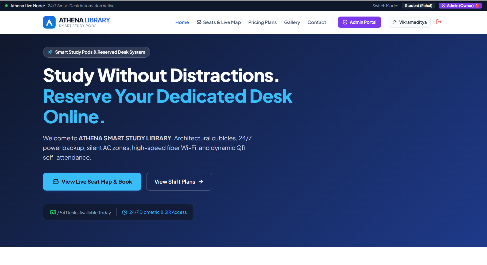
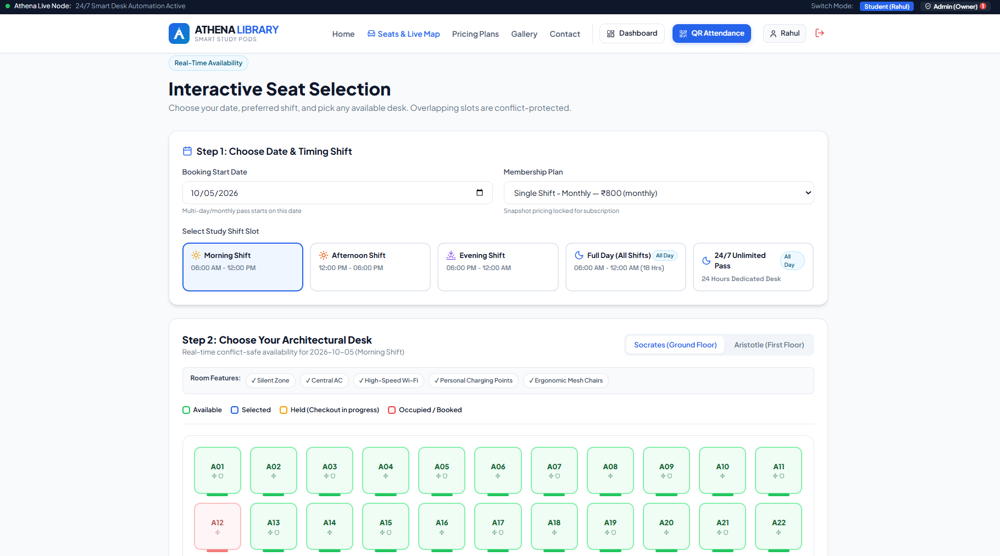
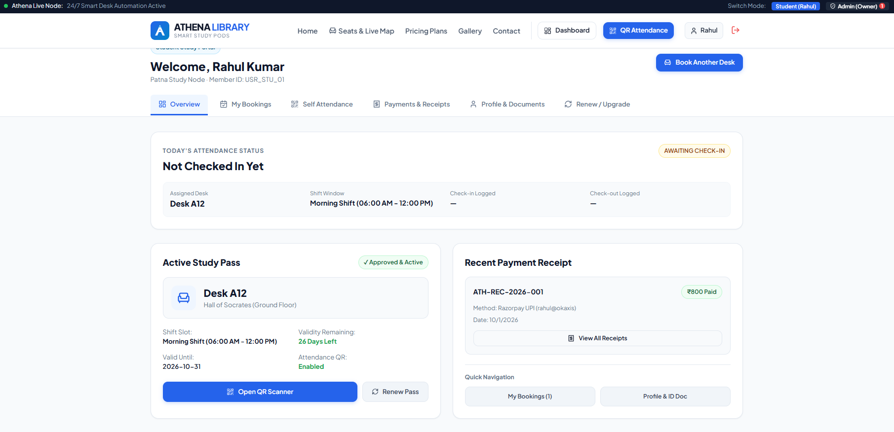
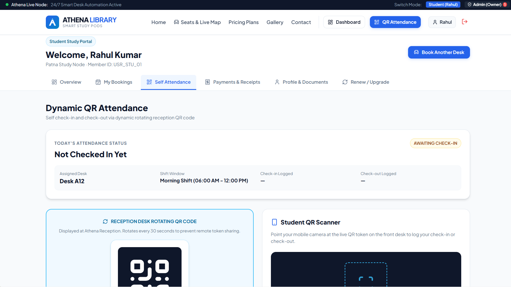

# 📚 Athena Library | Smart Seat Booking & Attendance System

<p align="center">
  
</p>

<h3 align="center">
Smart Seat Booking • Dynamic QR Attendance • Payments • Student & Admin Management
</h3>

<p align="center">


</p>

---

## 📖 About The Project

**Athena Library** is a full-stack digital management platform designed for commercial study libraries, reading rooms, and dedicated study spaces.

The platform brings together:

- Online desk reservations
- Real-time seat availability
- Conflict-safe seat allocation
- Multiple study shifts
- Razorpay payment workflows
- Dynamic QR attendance
- Student profile and document management
- Payment receipts
- Membership renewals
- Administrative operations

Students can reserve their preferred desk and study timing online, while administrators can manage bookings, students, payments, attendance, pricing, seats, and library operations from a centralized portal.

---

# 🖥️ Application Preview

## 🏠 Athena Library Homepage

<p align="center">
  
</p>

The homepage provides a modern introduction to **Athena Smart Study Library** with quick access to the live seat map, pricing plans, gallery, contact information, student dashboard, and administrator portal.

Students can quickly check desk availability and proceed directly to the online seat reservation system.

---

## 🪑 Interactive Seat Selection

<p align="center">
  
</p>

Athena provides an interactive architectural seat-selection interface where students can select their preferred:

- 📅 Booking start date
- 🌅 Morning shift
- ☀️ Afternoon shift
- 🌆 Evening shift
- 🌙 Full-day plan
- 🕐 24/7 dedicated desk plan
- 🪑 Study desk
- 🏢 Reading hall
- 💳 Membership plan

The live seat map visually represents:

- 🟢 Available desks
- 🔵 Selected desks
- 🟠 Temporarily held desks
- 🔴 Occupied / booked desks

The booking engine is designed to prevent conflicting reservations across overlapping study shifts.

---

## 👨‍🎓 Student Dashboard

<p align="center">
  
</p>

The student dashboard acts as a central control panel for the student's library membership.

Students can view:

- Assigned study desk
- Current study shift
- Active study pass
- Membership validity
- Attendance status
- Recent payments
- Payment receipts
- Booking history
- Profile information
- Uploaded documents
- Renewal options

Students can also directly open the QR attendance scanner or book another desk.

---

## 📱 Dynamic QR Attendance

<p align="center">
  
</p>

Athena includes a **dynamic QR-based attendance system** for student check-in and check-out.

A rotating QR token can be displayed at the library reception. Students scan the live QR using their device to record attendance.

The attendance module tracks:

- Assigned desk
- Student shift
- Check-in status
- Check-in time
- Check-out time
- Current attendance state

The QR can rotate periodically to reduce remote token sharing and make self-attendance more reliable.

---

# ✨ Key Features

## 👨‍🎓 Student Portal

### 🪑 Interactive Seat Map
Live architectural layout of desks across reading halls with dynamic availability indicators.

### 🔄 Conflict-Safe Booking
Helps prevent double-booking across overlapping:

- Morning shifts
- Afternoon shifts
- Evening shifts
- Full-day reservations
- 24/7 dedicated desk plans

### 📱 Dynamic QR Attendance
Students can perform self check-in and check-out using reception-based rotating QR tokens.

### 💳 Digital Payments
Online payment workflow designed for integration with Razorpay.

### 🧾 Payment Receipts
Students can view their recent transactions and payment receipts directly from the portal.

### 🔁 Membership Renewal
Students can renew or upgrade their study plan through the student dashboard.

### 👤 Profile & Documents
Student profile information and identification documents can be managed through the student portal.

### 📅 Attendance History
Students can monitor their attendance records and current attendance status.

---

# 🛡️ Admin & Owner Portal

## 📊 Operations Dashboard

Administrators can monitor key library activities such as:

- Active bookings
- Students
- Seat occupancy
- Attendance
- Payments
- Revenue

---

## ✅ Booking Requests

Administrators can review and manage student booking requests from the admin portal.

---

## 🧍 Offline Admissions

Walk-in students can also be registered through the administrative system.

This enables the library to manage both:

- Online students
- Offline students

within the same platform.

---

## 🪑 Seat Management

Administrators can manage the library's available study desks and room capacity.

Seats can be organized based on:

- Study halls
- Floors
- Availability
- Booking status

---

## 📋 Attendance Management

The admin portal provides centralized attendance monitoring for registered students.

---

## 💳 Payment Management

Administrators can monitor payment records and student transactions.

---

## 💰 Revenue Dashboard

Revenue information can be monitored from the administration portal for better operational visibility.

---

## 💵 Pricing Management

Library membership plans and pricing can be managed through the admin system.

---

## ⚙️ Website Settings

Administrative pages are available for managing library-related settings and website information.

---

# 🚀 Core Modules

| Module | Description |
|---|---|
| 🪑 Seat Booking | Interactive online desk reservation |
| 📍 Live Seat Map | Shows current seat availability |
| ⏰ Shift Selection | Morning, afternoon, evening and extended plans |
| 📱 QR Attendance | Digital student check-in/check-out |
| 💳 Payments | Online payment workflow |
| 🧾 Receipts | Student payment receipt management |
| 👨‍🎓 Student Portal | Student bookings, attendance and payments |
| 🛡️ Admin Portal | Central administration dashboard |
| 👥 Student Management | Manage registered students |
| 💰 Revenue | Monitor library income |
| 🔁 Renewals | Membership renewal workflow |
| 🔐 Authentication | Protected student/admin access |

---

# 🛠️ Technology Stack

## Frontend

| Technology | Purpose |
|---|---|
| React.js | User interface |
| Vite | Development & build tooling |
| React Router | Application routing |
| CSS | Responsive user interface |

## Backend

| Technology | Purpose |
|---|---|
| Node.js | Server runtime |
| Express.js | REST API |
| MongoDB | Database |
| Mongoose | Database models |
| JWT | Authentication & authorization |

## Integrations

| Technology | Purpose |
|---|---|
| Razorpay | Payment workflow |
| QR System | Attendance |
| REST API | Frontend-backend communication |

---

# 📁 Project Structure

```text
Library-System/
│
├── src/
│   │
│   ├── components/
│   │   ├── common/
│   │   │   ├── Navbar.jsx
│   │   │   ├── Footer.jsx
│   │   │   ├── ProtectedRoute.jsx
│   │   │   ├── Loader.jsx
│   │   │   └── Modal.jsx
│   │   │
│   │   ├── booking/
│   │   │   ├── SeatMap.jsx
│   │   │   ├── SeatCard.jsx
│   │   │   ├── ShiftSelector.jsx
│   │   │   ├── PricingCard.jsx
│   │   │   └── BookingSummary.jsx
│   │   │
│   │   └── attendance/
│   │       ├── QRScanner.jsx
│   │       ├── CheckInCard.jsx
│   │       └── AttendanceCalendar.jsx
│   │
│   ├── pages/
│   │   │
│   │   ├── public/
│   │   │   ├── Home.jsx
│   │   │   ├── Seats.jsx
│   │   │   ├── Pricing.jsx
│   │   │   ├── Gallery.jsx
│   │   │   ├── Contact.jsx
│   │   │   └── RulesPolicy.jsx
│   │   │
│   │   ├── auth/
│   │   │   ├── Login.jsx
│   │   │   ├── Register.jsx
│   │   │   └── ForgotPassword.jsx
│   │   │
│   │   ├── student/
│   │   │   ├── StudentDashboard.jsx
│   │   │   ├── MyBookings.jsx
│   │   │   ├── Checkout.jsx
│   │   │   ├── PaymentResult.jsx
│   │   │   ├── MyPayments.jsx
│   │   │   ├── MyAttendance.jsx
│   │   │   ├── RenewBooking.jsx
│   │   │   └── MyProfile.jsx
│   │   │
│   │   └── admin/
│   │       ├── AdminDashboard.jsx
│   │       ├── Students.jsx
│   │       ├── BookingRequests.jsx
│   │       ├── AllBookings.jsx
│   │       ├── SeatManagement.jsx
│   │       ├── PricingManagement.jsx
│   │       ├── Attendance.jsx
│   │       ├── Payments.jsx
│   │       ├── Revenue.jsx
│   │       ├── OfflineAdmissions.jsx
│   │       ├── WebsiteSettings.jsx
│   │       └── Settings.jsx
│   │
│   ├── layouts/
│   │   ├── PublicLayout.jsx
│   │   ├── StudentLayout.jsx
│   │   └── AdminLayout.jsx
│   │
│   ├── context/
│   │   ├── AuthContext.jsx
│   │   └── LibraryContext.jsx
│   │
│   ├── services/
│   │   ├── api.js
│   │   └── authService.js
│   │
│   ├── data/
│   │   └── athenaData.js
│   │
│   ├── App.jsx
│   └── index.css
│
├── backend/
│   │
│   ├── src/
│   │   │
│   │   ├── config/
│   │   │   ├── db.js
│   │   │   ├── paymentGateway.js
│   │   │   └── storage.js
│   │   │
│   │   ├── middleware/
│   │   │   ├── authMiddleware.js
│   │   │   └── roleMiddleware.js
│   │   │
│   │   ├── models/
│   │   │   ├── Attendance.js
│   │   │   ├── Booking.js
│   │   │   ├── LibrarySettings.js
│   │   │   ├── Notification.js
│   │   │   ├── Payment.js
│   │   │   ├── PricingPlan.js
│   │   │   ├── Room.js
│   │   │   ├── Seat.js
│   │   │   ├── SeatAllocation.js
│   │   │   ├── StudentProfile.js
│   │   │   └── User.js
│   │   │
│   │   ├── routes/
│   │   │   ├── adminRoutes.js
│   │   │   ├── attendanceRoutes.js
│   │   │   ├── authRoutes.js
│   │   │   ├── bookingRoutes.js
│   │   │   ├── paymentRoutes.js
│   │   │   ├── seatRoutes.js
│   │   │   └── studentRoutes.js
│   │   │
│   │   ├── services/
│   │   │   ├── bookingEngine.js
│   │   │   └── qrService.js
│   │   │
│   │   └── utils/
│   │       └── seedData.js
│   │
│   ├── server.js
│   ├── package.json
│   └── .env.example
│
├── docs/
│   ├── screenshots/
│   │   ├── home.png
│   │   ├── seat-selection.png
│   │   ├── student-dashboard.png
│   │   └── qr-attendance.png
│   │
│   ├── API.md
│   ├── DATABASE.md
│   ├── DEPLOYMENT.md
│   └── USER-MANUAL.md
│
├── public/
│   └── logo.svg
│
├── package.json
├── vite.config.js
└── README.md
